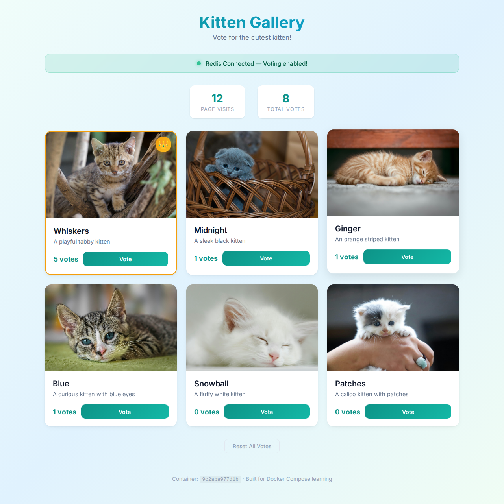

# Kitten Gallery - Docker vs Docker Compose

> Build a kitten voting gallery and discover why Docker Compose exists - by seeing what breaks without it.



## What You'll Learn

- [ ] Running a container with `docker run` and understanding its limitations
- [ ] Why multi-container apps need orchestration
- [ ] Writing a `docker-compose.yml` to connect services
- [ ] How Docker Compose handles networking between containers
- [ ] Using volumes for data persistence

## Prerequisites

- Docker and Docker Compose installed ([install guide](https://docs.docker.com/get-docker/))
- Basic understanding of Docker images and containers
- Comfort with the terminal

## The App

This is a Flask web application where users vote for their favorite kittens. It has:

- **A web frontend** that displays kitten cards with photos and voting buttons
- **A Redis database** that stores vote counts and visit statistics

The interesting part? The app is designed to work *with or without* Redis. When Redis isn't available, voting is disabled and the app shows a "disconnected" state. This makes it the perfect tool for understanding **why Docker Compose matters**.

## Part 1: Run It With Just Docker

First, let's see what happens when we run only the web container, without Redis.

### Build the image:

```bash
docker build -t kitten-gallery .
```

### Run the container:

```bash
docker run -p 5000:5000 --name kitten-app kitten-gallery
```

### Open http://localhost:5000 in your browser.

**What do you see?**

- The kittens show up, but voting is **disabled**
- The status banner shows **"Redis not connected"**
- There's no visit counter
- No crown on any kitten

This is the problem. The web app is running, but it can't reach the Redis database because **there is no Redis container**, and even if there were, the containers wouldn't know how to find each other.

### Stop and remove the container:

```bash
docker stop kitten-app && docker rm kitten-app
```

## Part 2: Your Mission

**Create a `docker-compose.yml` file** that runs both the web application and a Redis database together, with proper networking and data persistence.

When you're done, the app should:
- Show "Redis Connected - Voting enabled!"
- Let you vote for kittens
- Display a visit counter
- Crown the kitten with the most votes
- **Keep votes even after restarting** the containers

## Think About...

Before you start writing, consider these questions:

- What services does this application need?
- How does the web app know where to find Redis? (Hint: check `app.py` for environment variables)
- What happens to vote data when you run `docker compose down`? How do you prevent data loss?
- Does the Redis service need a Dockerfile, or can you use an existing image?

## Hints

<details>
<summary>Hint 1: Service structure</summary>

Your `docker-compose.yml` needs two services:
- `web` - builds from the Dockerfile in this directory
- `redis` - uses the official `redis:alpine` image

</details>

<details>
<summary>Hint 2: Networking and environment variables</summary>

Look at line 22 in `app.py`:
```python
redis_host = os.environ.get('REDIS_HOST', 'localhost')
```

In Docker Compose, services can reach each other by their **service name**. So if your Redis service is called `redis`, you need to set the environment variable `REDIS_HOST=redis` on the web service.

</details>

<details>
<summary>Hint 3: Data persistence</summary>

Redis stores data in the `/data` directory inside its container. To persist this data, create a **named volume** and mount it to `/data` on the Redis service.

Without a volume, all votes are lost when you run `docker compose down`.

</details>

<details>
<summary>Hint 4: Putting it together</summary>

Your docker-compose.yml should have:
- `services:` with `web` and `redis`
- `web` should use `build: .`, map a port, set `REDIS_HOST`, and `depends_on: redis`
- `redis` should use `image: redis:alpine` and mount a named volume
- A top-level `volumes:` section declaring the named volume

</details>

## Verify It Works

You'll know you've succeeded when:

1. `docker compose up -d` starts both containers without errors
2. `docker compose ps` shows two running services
3. Opening http://localhost:5000 shows **"Redis Connected - Voting enabled!"**
4. You can vote for kittens and the count increases
5. The kitten with the most votes gets a crown
6. After running `docker compose down` and `docker compose up -d` again, **your votes are still there**

### Test data persistence:

```bash
# Vote for some kittens in the browser, then:
docker compose down
docker compose up -d
# Refresh the page - are your votes still there?
```

### Full reset (removes volumes too):

```bash
docker compose down -v
```

## Key Takeaways

- **Docker alone** runs isolated containers that can't easily communicate with each other
- **Docker Compose** creates a shared network where services find each other by name
- `depends_on` controls startup order (Redis starts before the web app)
- **Named volumes** persist data across container restarts and recreations
- A single `docker-compose.yml` replaces multiple long `docker run` commands
- In production, most applications are multi-container - Docker Compose is the standard tool for defining and running them

## Solution

Ready to check your work?

```bash
git checkout solution
```

## Bonus Challenges

1. **Explore the network**: Run `docker compose exec web sh` and try `ping redis` from inside the container
2. **Inspect the setup**: Run `docker network ls` and `docker volume ls` to see what Compose created
3. **Scale it**: What happens if you try `docker compose up --scale web=3`? Does it work? Why or why not?
4. **Add a health check**: Modify `docker-compose.yml` to include a health check for the Redis service

---

*Created by [Carmit Haas](https://github.com/CarmitHaas) - hands-on Docker & DevOps training*
